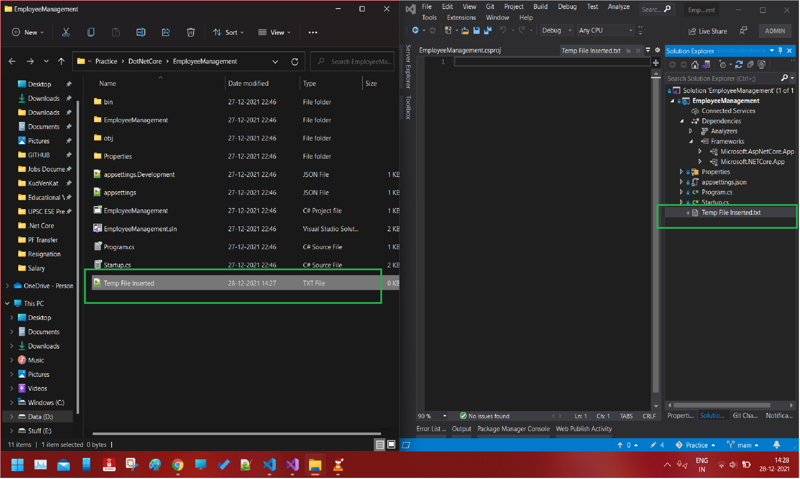

# ASP .Net Core Project File

- .csproj for C# based web app and .vbproj for VB based web app
- The format and content written in this file has significantly changed in .Net Core
- In previous .Net Projects, we could edit the .csproj or .vsproj file only after unloading the project from Solution Explorer and then opening the file. In .Net Core, we we can simply right click on the Project and then select Edit Project File
- File or Folder references are no longer included in the project file. In older versions whenever we used to add new files or Items in the project, a reference of the same was added to this project file
- The File System determines what files and folders belong to the project. You can test this by simply placing a file in the root folder in Windows Explorer and see it will get reflected in the Solution Explorer for that project. If you delete it from the Windows Explorer, the same will be deleted from the project also.

  - 

## TargetFramework element

- Specifies the target framework for the application
- To specify a taret framework we use Target Framework Moniker (TFM)

  - ```EmployeeManagement.csproj
    <Project Sdk="Microsoft.NET.Sdk.Web">

       <PropertyGroup>
    <TargetFramework>netcoreapp3.1</TargetFramework>
       </PropertyGroup>

    </Project>

    ```

- Naming Convention

  - | Name           | Abbreviation | TFM           |
    | -------------- | ------------ | ------------- |
    | .Net Framework | net          | net451        |
    | .Net Framework | net          | net472        |
    | .Net Core      | netcoreapp   | netcoreapp1.0 |
    | .Net Framework | netcoreapp   | netcoreapp2.2 |

## ASPNETCoreHostingModel element

- Specifies how the application should be hosted
- InProcess or OutOfProcess
  - InProcess hosts the app inside of the IIS Worker Process (w3wp.exe)
  - OutOfProcess hosting model forwards web requests to a backend ASP .Net Core app running the Kestrel Server
  - The default is OutOfProcess hosting

## PackageReference element

- Used to include a reference to the NuGet packages that are installed for the application. It may look something like below

  - ```directly Inside The .csproj File
    <ItemGroup>
     <PackageReference Include="Microsoft.AspNetCore.App"/>
     <PackageReference Include="Microsoft.AspNetCore.Razor.Design" Version="2.2.0" ....... />
    </ItemGroup>
    ```

  - Now, the package reference `Microsoft.AspNetCore.App` is called a Metapackage and it does not require any version for the IDE will find it implicitly. Metapackage also has no content of its own. It just contains the list of other dependencies. This Metapackage has most of the things that we need to develop or ASP .Net Core application

## Note

The content of the video series you follwed for learning .Net Core was for .Net Core 2.2 but while learning .Net Core 3.1 came out. So you may not see all the elements in your project file.
