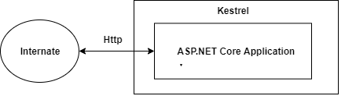

# ASP .Net Core Hosting

Once you successfully developed your web application, what should be the next step you have to do? The answer is `Hosting`. We have to host our application to the server so that other people can access it. The process of deploying/installing an application into the server is called **Hosting**.

Whenever you create an ASP.NET Core application, by default it contains an internal server provided by a .NET Core that is called Kestrel. Due to this server, we can run ASP.NET Core apps on any platform like Windows, Mac or Linux. Before getting into the details about hosting models, let's first see what is the Kestrel server.

## What is the Kestrel Server?

Kestrel is a cross-platform web server for ASP.NET Core. Kestrel is the webserver that's included by default in ASP.NET Core project templates.

Kestrel is based on the [libuv](https://github.com/libuv/libuv) library, the same library which is used by Node.

Some features of Kestrel:

- It supports SSL
- lightweight
- cross-platform

## Hosting Models in ASP.NET Core

There are 2 types of hosting models in ASP.NET Core i.e In-process Hosting and Out-of-process Hosting. Before ASP.Net Core 2.2 we have only one hosting model which is Out-of-process but after due to the performance we have In Process Hosting Model in 2.2+ versions.

## InProcess Hosting

After the release of .NET Core 2.2, it introduced a new type of hosting which is called In-process hosting. In this type, only one server is used for hosting like IIS, Nginx or Linux. It means that the App is directly hosted inside of IIS. No Kestrel server is being used. IIS HTTP Server (IISHttpServer) is used instead of the Kestrel server to host apps in IIS directly. ASP.NET Core 3.1 onwards **In-process** hosting model is used as a default model whenever you create a new application using an existing template.

- **Default** hosting model in ASP .Net Core 3.1 onwards.
- Running the Project from visual studio using `Debug` -> `Start Without Debugging`, the project will start using IIS Server as shown below. Offcourse, the version of ASP .Net Core app in this example is 3.1

## OutOfProcess Hosting

In OutOfProcess hosting models, we can either use the Kestrel server directly as a user request facing server or we can deploy the app into IIS which will act as a proxy server and sends requests to the internal Kestrel server. In this type of hosting model we have two options:

- **Using Kestrel**: So in this type Kestrel itself acts as edge server which directly server user requests. It means that we can only use the Kestrel server for our application.

  - 

- **Using a Proxy Server**: Due to limitations of the Kestrel server, we can not use this in all the apps. In such cases, we have to use powerful servers like IIS, NGINX or Apache. So, in that case, this server acts as a reserve proxy server which redirects every request to the internal Kestrel sever where our app is running. Here, two servers are running. One is IIS and another is Kestrel.

  - 

  - This model is a default model for all the applications implemented before .NET Core 2.2. But there are some of the limitations of using this type such as performance slowness.

- **Default** hosting model in ASP .Net Core earlier version.

- When we build and run the project from Visual Studio Command Line by `Tools` -> `Command Line` -> `Developer Command Prompt`, and use `dotnet run` command the project will run using the ketrel server as shown below:

