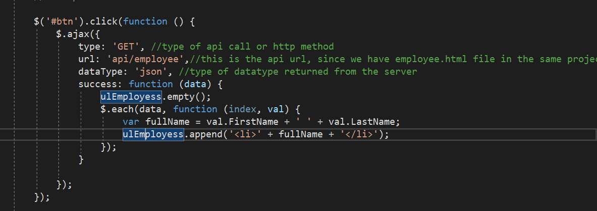
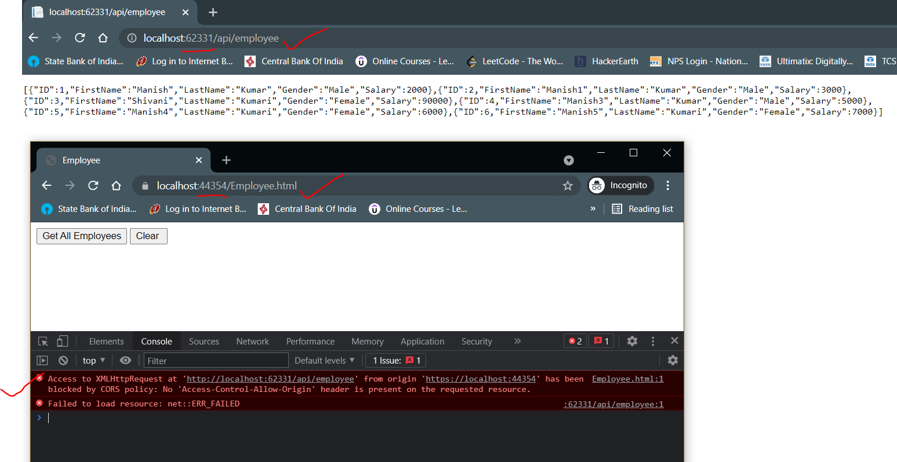

# Ajax calls in Web API

See the below screenshot, how the ajax is being used.


Project location: `\GITHUB\Practice\WebAPI\2WebAPIAndDBWithEntity` -> Employee.html

Thing is here the `url` parameter is having `api/employee`, this is a relative url, because the api and the HTML file(client) are present in the same project (say domain).

By default this is allowed. But if the api and the client are present in different projects then it will become cross domain and it will violate the `same origin` policy that browsers uphold.

## Same Origin Policy

Browsers allow a webpage to make AJAX requests only within the same domain. Browser security prevents a web page from making AJAX request to another domain.

The below are having same origin:

http://localhost:1234/api/employees

http://localhost:1234/Employees.html

The above links same domain, same port noumber

The below are having differnet origin:

http://localhost:1234/api/employees

http://localhost:4567/Employee.html

The above different port number.

The below are having different origin:

http://manish.com/api/employees

http://manish.net/api/employees

The below are having different domain

The below are having different origin:

https://manish.com/api/employees

http://manish.net/api/employees

The below are having different schemes (http vs https)

If you do end up invoking the an api from an different domain, below is the error that you will receive.



## Fixing the issue

Now that we understand that for security reasons the browser doesn't allow the cross domain ajax requests. There are two ways to get around the issue:

1. Using JSONP ( JSON with Padding)
2. Enabling CORS (Cross Origin Resource Sharing)

### JSONP

| JSON | JSONP |
| ---- | ----- |

|

```JSON
{
"FirstName": "Mark",
"LastName": "Hastings",
"Gender": "Male"
}

```

|

```JSONP
CallbackFunction({
"FirstName": "Mark",
"LastName": "Hastings",
"Gender": "Male"
})

```

|
