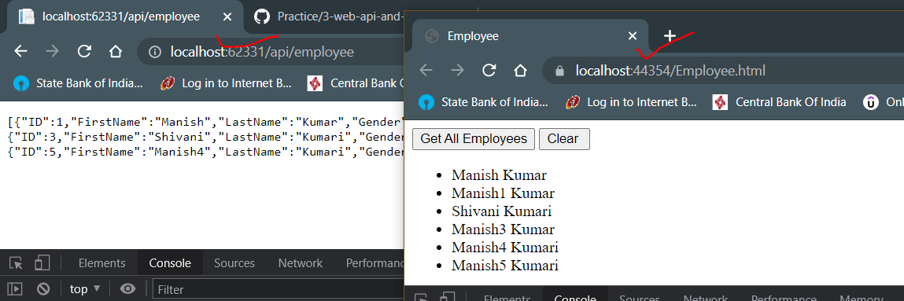

# Ajax calls in Web API

See the below screenshot, how the ajax is being used.


Project location: `\GITHUB\Practice\WebAPI\2WebAPIAndDBWithEntity` -> Employee.html

Thing is here the `url` parameter is having `api/employee`, this is a relative url, because the api and the HTML file(client) are present in the same project (say domain).

By default this is allowed. But if the api and the client are present in different projects then it will become cross domain and it will violate the `same origin` policy that browsers uphold.

## Same Origin Policy

Browsers allow a webpage to make AJAX requests only within the same domain. Browser security prevents a web page from making AJAX request to another domain.

The below are having same origin:

http://localhost:1234/api/employees

http://localhost:1234/Employees.html

The above links same domain, same port noumber

The below are having differnet origin:

http://localhost:1234/api/employees

http://localhost:4567/Employee.html

The above different port number.

The below are having different origin:

http://manish.com/api/employees

http://manish.net/api/employees

The below are having different domain

The below are having different origin:

https://manish.com/api/employees

http://manish.net/api/employees

The below are having different schemes (http vs https)

If you do end up invoking the an api from an different domain, below is the error that you will receive.


## Fixing the issue

Now that we understand that for security reasons the browser doesn't allow the cross domain ajax requests. There are two ways to get around the issue:

1. Using JSONP ( JSON with Padding)
2. Enabling CORS (Cross Origin Resource Sharing)

### JSON

```JSON
{
"FirstName": "Mark",
"LastName": "Hastings",
"Gender": "Male"
}

```

### JSONP

```JSONP
CallbackFunction({
"FirstName": "Mark",
"LastName": "Hastings",
"Gender": "Male"
})

```

## How to use JSONP in our program, i.e. the client

1. we will need another package to work with JSONP
2. Open the Package Manager Console in Visual Studio Code: Tools->Nuget packet Manager->Package Manager Console
3. Run the command `Install-package WebApiContrib.Formatting.Jsonp`
4. Make sure to register this jsonp formatter in `Register` method of the api in `WebApiConfig.cs`
   
5. While making api call, now the server will return a jsonp formatter data. call the ajax method accordingly:
   
6. We have to make the change in all the places where ajax is being to call cross domain apis and handle the jsonp formatting
7. Make the change, build it and run to verify.
   

**Note:**

### What happens when we invoke the fiddler tool when we have jsonp formatting enabled

Make sure to give a callback function name (any string as function name) in query string. this name will be the function which is wrapping the data which is returning as json `http://localhost:62331/api/employee/?callback=mycallbackmethod`. Please refer below:


Now to get the data as json back in fiddler tool (make sure to remove the query string), simply give `Accept` header as `Accept: application/json` as shown below:


Now even if you supply the `Accept` header as `application/json`, and you supply the callback method name in the url, you will get the jsonp result back.


## How to use CORS (Cross Origin resource Sharing)

1. Install CORS Package `Install-package Microsoft.Asp.Net.WebApi.Cors`
2. Add the below to lines to enable cors globally. Refer the instruction as shown below in the `Register` method of the api in `WebApiConfig.cs`:
   
3. Once enabled globally, the API call from a different domain runs fine.
   

**Notes:**

- Cors can be enabled in a more granular way. Instead of declaring cors inside the `Register` method of the api in `WebApiConfig.cs`, simple give `config.EnableCors();` without any parameters
- Now, go to the sepcific controllers and use `[EnableCorsAttribute("*", "*", "*")]`. Don't forget to import `using System.Web.Http.Cors;`
  - Note the \* will work the same way it worked inside the `Register` methods of `WebApiConfig.cs`
- If you wish to disable cors for any specific controller method (offcourse where the cors is enable in the controller), you can use the attribute `[DisableCors]`
- `Acces-Control-Allow-Origin` must be set to \* or the origin site which will issue the ajax request, otherwise the browser security will not allow us to view the response result even if the request have been successful.
  
