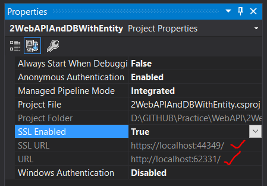

# Working with SSL in ASP .NET WebAPI

By default in our Web API project, the SSL was disabled. You can enable it by selecting the WebAPI project and clicking **F4**. This will launch the property window for the project. Select property: `SSL Enabled` to `True`

This is show you the SSL URL now as below:

You may see an issue while issue / lunaching the webapi in web browser. That's because, the ssl certificate provided by the IIS Express / localhost in not in trusted certificates. So open `the run command`-> launch `mmc.exe`. Here, go to `File` -> `Add/Remove Snap-in` -> `Certificates`

Select `certificates` -> you will find localhost -> Export it to you local without private. -> Import it to `Trusted Root Certification Authorities`

Once done, close all instance of the browsers -> launch the api again
