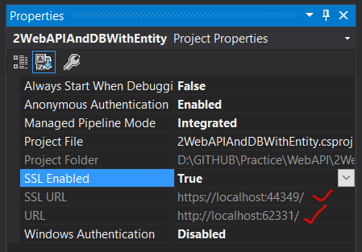
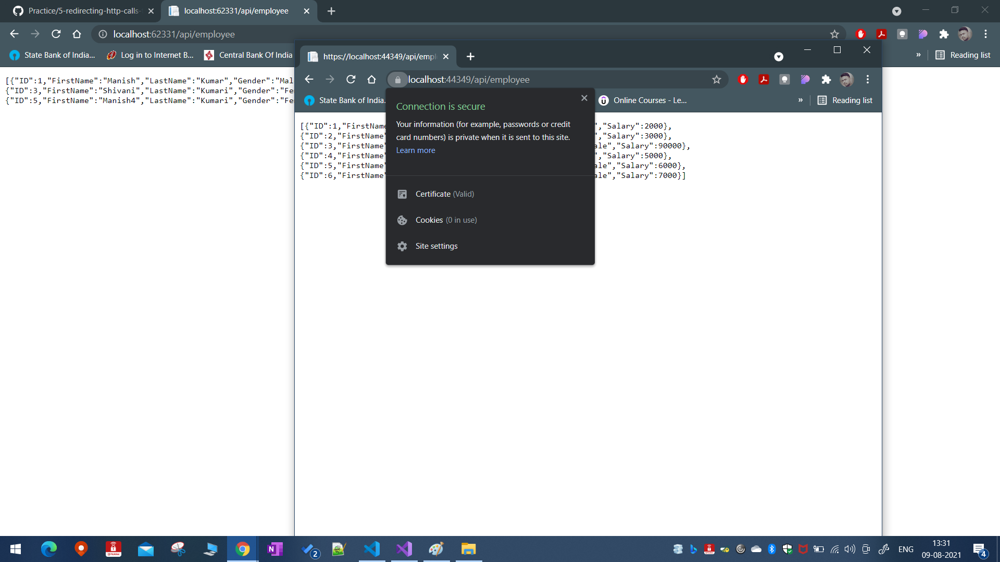
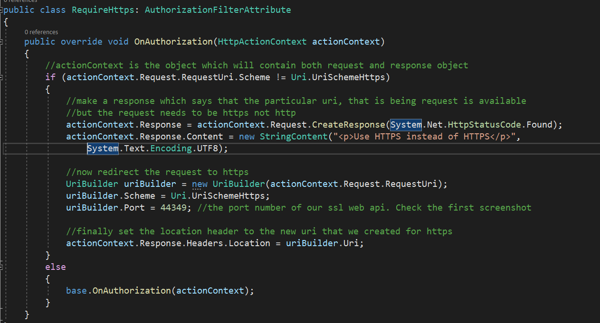
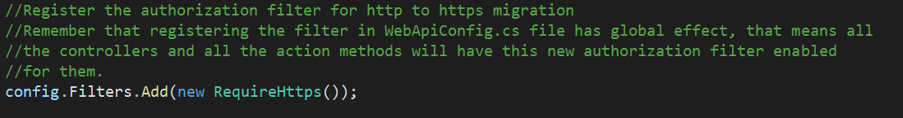
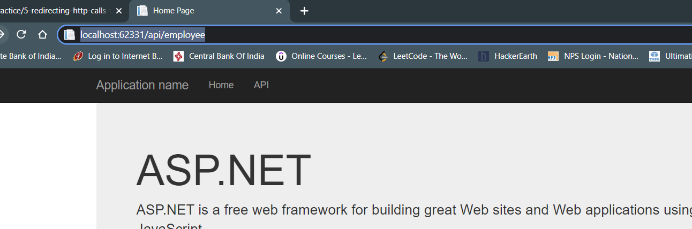
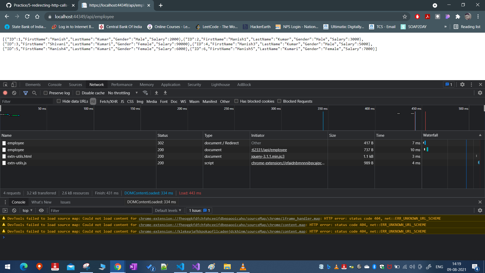
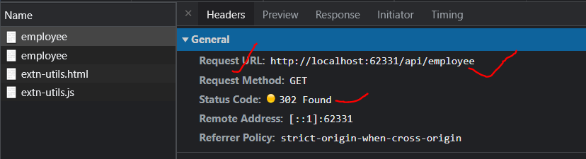
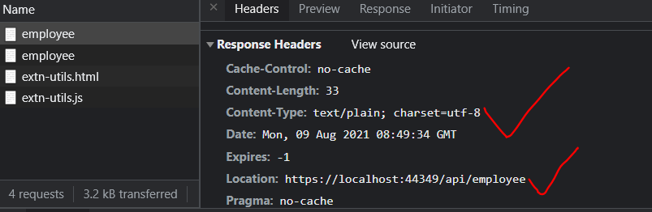
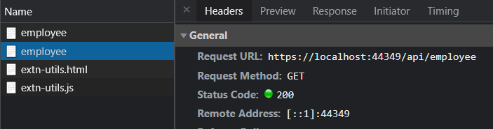
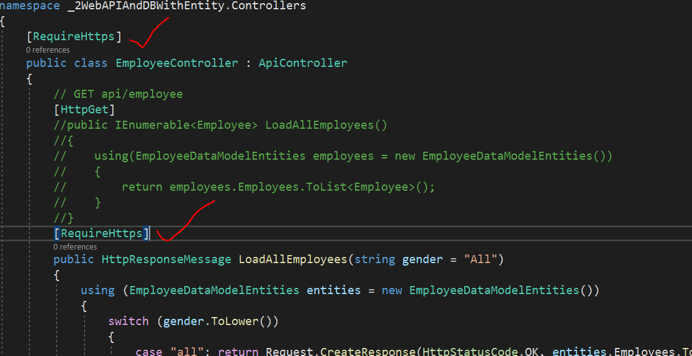

# Ensuring the security

In our previous section we saw that we can now make api calls of both http and https using our employee api. We also saw how to ensure that the `localhost` certificate is recognized by the browser when using https Uri Scheme. This was achieved by importing the `localhost` certificate into the `Trusted Root Certification Authorities` in `mmc.exe` utility.

Now, our goal is to ensure that even when http api call is made, the user is redirected to the https version of the webapi. Currently we have the below project properties (click `F4` on the project selection)

So we know that both the endpoint i.e. https and http are working fine as below

## How to achieve the redirction from HTTP to HTTPS

- To ensure that when we receive an http api call, we must be able to intercept it and see if the requested resource is available for https or not.
- We will add a new class `RequireHttps` which will check our api calls and make necessary changes if http api call is received.
- Make sure the class inherits from the `AutorizationFilterAttribute`
- We need to override the `OnAuthorization` method as this is the method which will be called to authorize whenever we decorate a given web api controller or action method using \[RequireHttps\] attribute. Please refer the below code snippet for more details.
  - 
- Now that we have coded the authorization, it is time to register the autorization class in our `WebApiConfig.cs` class. Just write the below code in it `config.Filters.Add(new RequireHttps());`
  - 
  - Then go ahead and build the solution
- Once it has been built, you can launch the https url as shown below:
  - 
  - the response will be in https
    - 
  - Then you see the same from the network tab in chrome dev tools
    - Initial request using http
      - 
    - Response to the initial request **302**
      - 
    - Final response from the API after redirection **200**
      - 
- If you don't want to enable this filter globally, then you can decorate the relevant controller classes and action methods with the class name i.e. `[RequireHttps]` in our example
  - 
