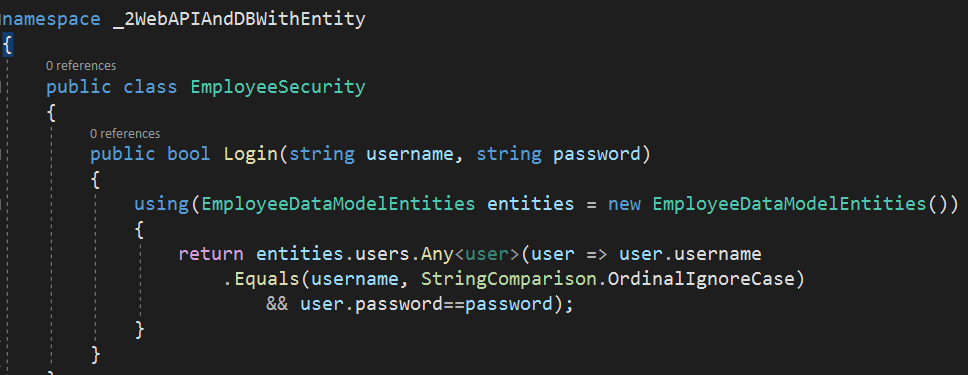
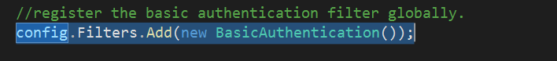
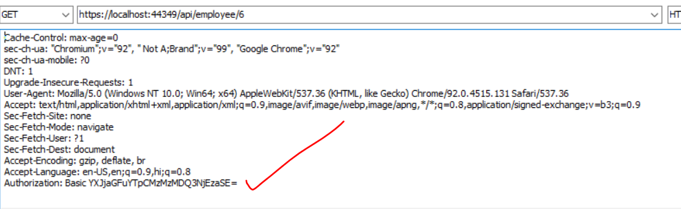
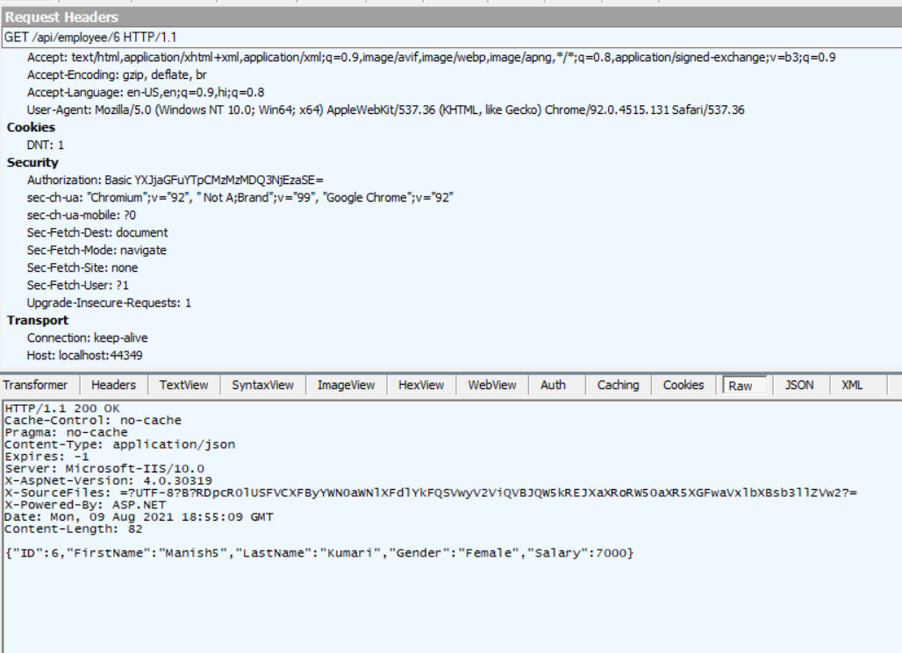
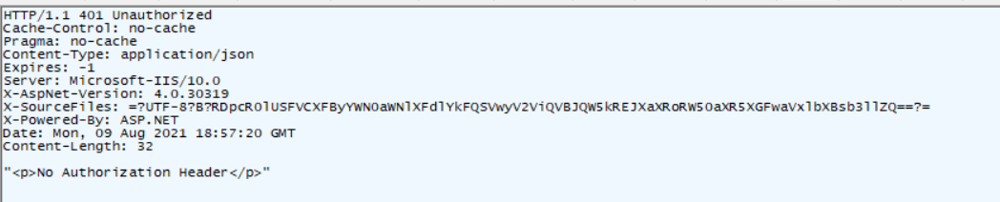

# Implementing Basic Authentication In Web API

The goal here is to require authentication before doing any operation in the web api. We will approach it the same way as we have done implemented the authorization filter while working with http to https api calls.

Note: in this example we will implement authorization after the api call has been migrated to https from https.
Note 1: We will enable the authentication globally, but we will test enabling the authentication in a more granular way also.

## How to Achieve basic authentication

- Make a user table in DB and insert values to for username and password
- Once the user table is created, update the employee entity data model, by right clicking after opening the .edmx file and finally click on `update model from database`. In the dialog box that appears select the users table click on finish.
- Now you have the users table ready for workinginside the web api.
- Make a class in your web api project which will have the logic of authenticating the users. It may look something like below:
  - 
- Now lets create a basic authentication filter. Remember to inherit the class `AuthorizationFilterAttribute` and then override the `OnAuthorization` method. Please refer the below code:
  - 
- Now you have the code for the basic Authentication filter. Register is globally in WebApiConfig.cs file using `config.Filters.Add(new BasicAuthentication());`. Same can be applied as attribute on specific controller or action methods, like we saw earlier.
  - 
- use this link to encode the username:password to [base64](https://www.base64encode.org/)
  - `manish:UZy@996sJR` becomes `bWFuaXNoOlVaeUA5OTZzSlI=`
  - `archana:B333047613i!` becomes `YXJjaGFuYTpCMzMzMDQ3NjEzaSE=`
- supply the authentication header as shown below:
  - 
  - Remember to use `Basic` keyword for the type of authentication
  - On success:
    - 
  - On failure:
    - 
    - 

## **Note:**

It is important to note that, in our example we had an logic in place which redirected http api call to https. The authorization filter doesn't work in this case because, we have no way of supplying the authorization header values to location header of the response in the RequireHttps class. Hence after redirection from http to http the authorization header supplied in the http api call gets lost. And we are filtering for authorization header specifically, this result in `No Authorization header found` issue.

We can handle it if we are not redirection the http api call to https, and simply telling user to make an https call instead of http call.
