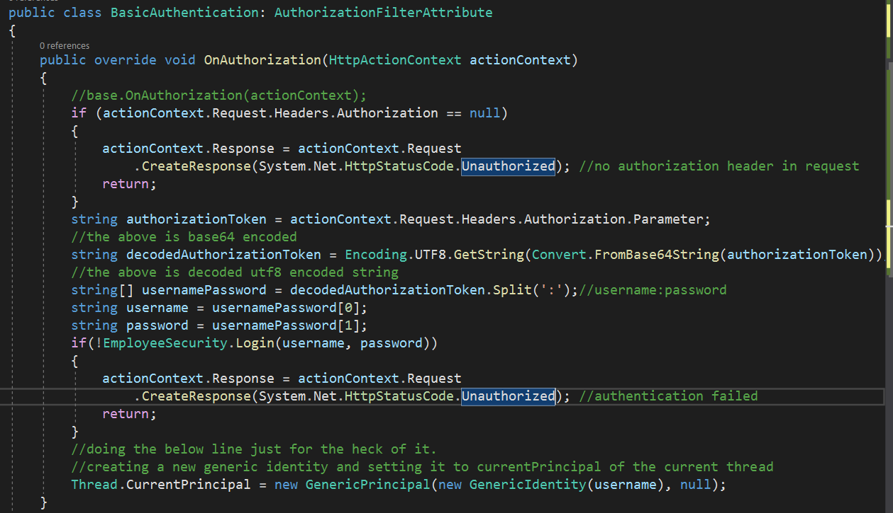
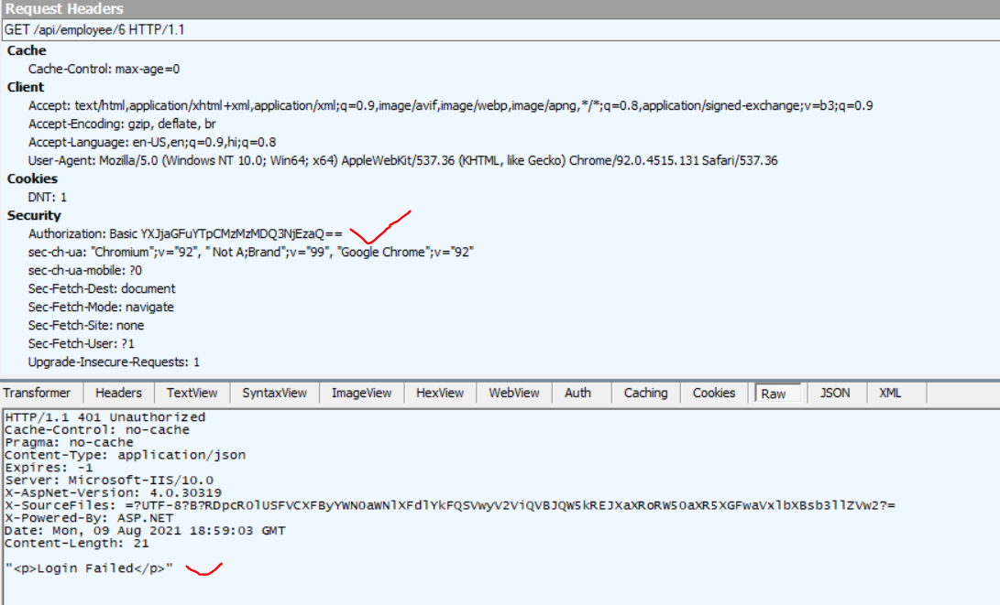
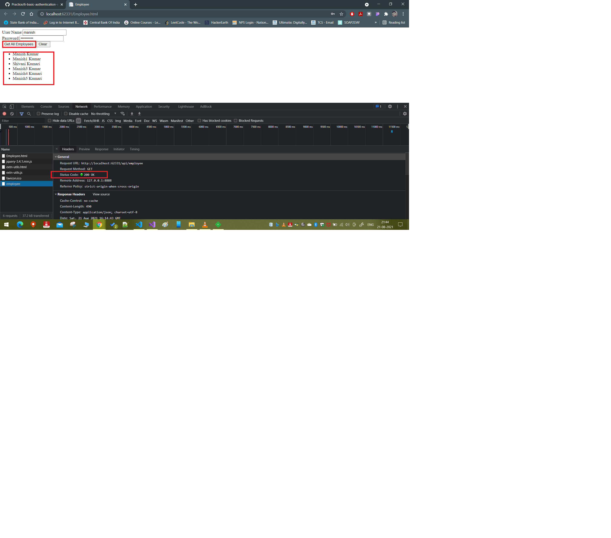
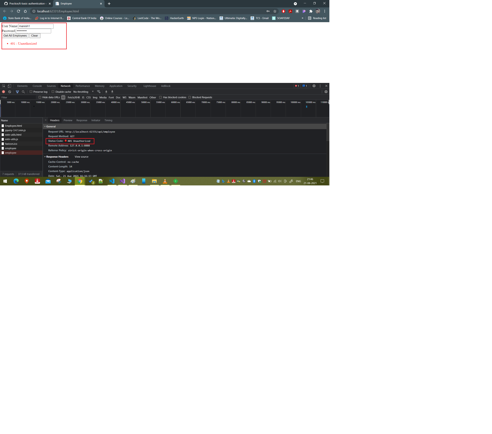

# Implementing Basic Authentication In Web API

Project: 2WebAPIAndDBWithEntity

The goal here is to require authentication before doing any operation in the web api. We will approach it the same way as we have done implemented the authorization filter while working with http to https api calls.

Note: in this example we will implement authorization after the api call has been migrated to https from https.
Note 1: We will enable the authentication globally, but we will test enabling the authentication in a more granular way also.

## How to Achieve basic authentication

- Make a user table in DB and insert values to for username and password
- Once the user table is created, update the employee entity data model, by right clicking after opening the .edmx file and finally click on `update model from database`. In the dialog box that appears select the users table click on finish.
- Now you have the users table ready for workinginside the web api.
- Make a class in your web api project which will have the logic of authenticating the users. It may look something like below:
  - 
- Now lets create a basic authentication filter. Remember to inherit the class `AuthorizationFilterAttribute` and then override the `OnAuthorization` method. Please refer the below code:
  - 
- Now you have the code for the basic Authentication filter. Register is globally in WebApiConfig.cs file using `config.Filters.Add(new BasicAuthentication());`. Same can be applied as attribute on specific controller or action methods, like we saw earlier.
  - 
- Use this link to encode the username:password to [base64](https://www.base64encode.org/)
  - `manish:UZy@996sJR` becomes `bWFuaXNoOlVaeUA5OTZzSlI=`
  - `archana:B333047613i!` becomes `YXJjaGFuYTpCMzMzMDQ3NjEzaSE=`
  - `archana:B333047613i` becomes `YXJjaGFuYTpCMzMzMDQ3NjEzaQ==` (for login failed case)
- supply the authentication header as shown below:
  - 
  - Remember to use `Basic` keyword for the type of authentication
  - On success:
    - 
  - On failure:
    - 
    - 

## **Note:**

It is important to note that, in our example we had an logic in place which redirected http api call to https. The authorization filter doesn't work in this case because, we have no way of supplying the authorization header values to location header of the response in the RequireHttps class. Hence after redirection from http to http the authorization header supplied in the http api call gets lost. And we are filtering for authorization header specifically, this result in `No Authorization header found` issue.

We can handle it if we are not redirection the http api call to https, and simply telling user to make an https call instead of http call.

## Basic Authentication on a web page

Now we have implemented the basic authentication and tested it using Fiddler, but in real time scenario, we will be using this authentication to execute some function in our website.

We have the `Employee.html` web page in web api project which displays the list of all employees. If you click on get eployee details button right now, we will get an error as shown below:


This is happening because, we are not passing the `Authorization` header in our request, when we are making the request from the webpage. The below code will fix this issue:

```javascript
$("#btn").click(function () {
  var userName = $("#txtUserName").val();
  var password = $("#txtPassword").val();
  //console.log('username', userName, 'password', password);
  $.ajax({
    type: "GET", //type of api call or http method
    url: "api/employee", //this is the api url, since we have employee.html file in the same project as the web api, so this is okay
    dataType: "json", //type of datatype returned from the server
    //dataType:'jsonp', //to enable cross domain api call using jsonp formatter
    headers: {
      //adding a authorization header
      Authorization: "Basic " + btoa(`${userName}:${password}`),
    },
    success: function (data) {
      ulEmployess.empty();
      $.each(data, function (index, val) {
        var fullName = val.FirstName + " " + val.LastName;
        ulEmployess.append("<li>" + fullName + "</li>");
      });
    },
    complete: function (jqXHR) {
      //this method will run once once the jQuery XMLHttp request is completed
      if (jqXHR.status == "401") {
        ulEmployess.empty();
        ulEmployess.append(
          '<li style="color:red">' +
            jqXHR.status +
            " : " +
            jqXHR.statusText +
            "</li>"
        );
      }
    },
  });
});
```

And once the changes are saved, we have the below result:

- SUCCESS
  - 
- FAILURE
  - 

## Note

Uptill this point we did not entertain the cross origin api call. Lets make some changes to the client web app where similar Employee.html is present. we only need to make a minor change to the api url and rest of the things will remain the same.

```javascript code
$("#btn").click(function () {
  var userName = $("#txtUserName").val();
  var password = $("#txtPassword").val();
  $.ajax({
    type: "GET", //type of api call or http method
    url: "http://localhost:62331/api/employee",
    //this is the api url, here we are trying to call an API from a different domain
    dataType: "json", //type of datatype returned from the server
    //dataType: 'jsonp', //to enable cross domain api call using jsonp formatter
    complete: function (jqXHR) {
      //this method will run once once the jQuery XMLHttp request is completed
      if (jqXHR.status == "401") {
        ulEmployess.empty();
        ulEmployess.append(
          '<li style="color:red">' +
            jqXHR.status +
            " : " +
            jqXHR.statusText +
            "</li>"
        );
      }
    },
    success: function (data) {
      ulEmployess.empty();
      $.each(data, function (index, val) {
        var fullName = val.FirstName + " " + val.LastName;
        ulEmployess.append("<li>" + fullName + "</li>");
      });
    },
    headers: {
      //adding a authorization header
      Authorization: "Basic " + btoa(`${userName}:${password}`),
    },
  });
});
```
