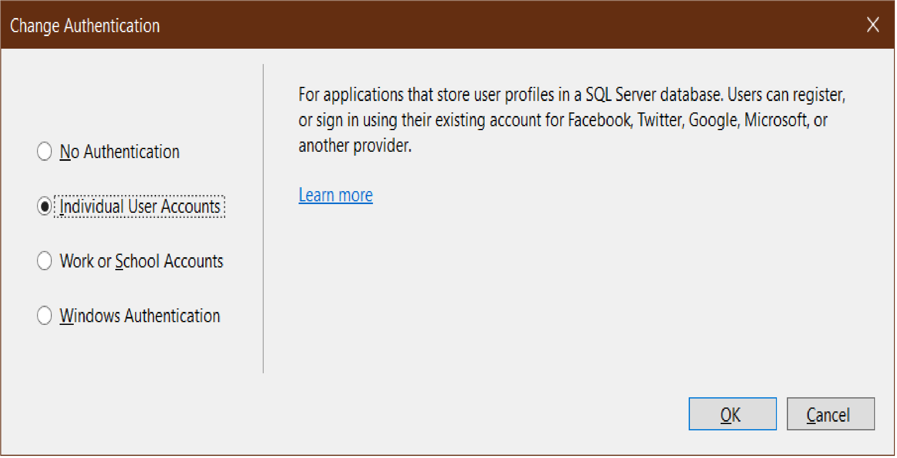
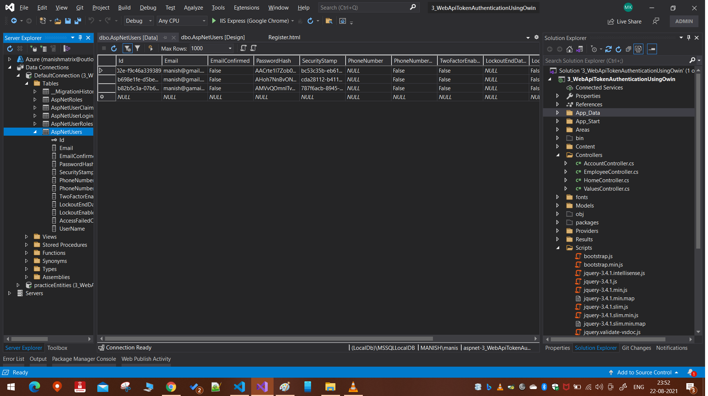
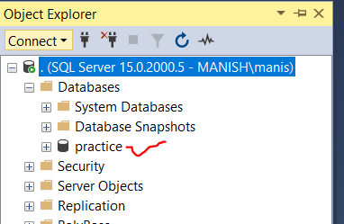
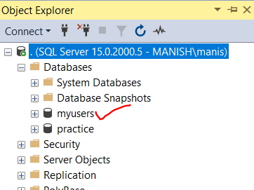
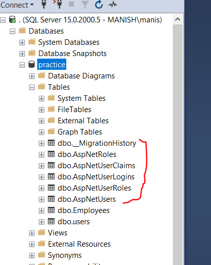
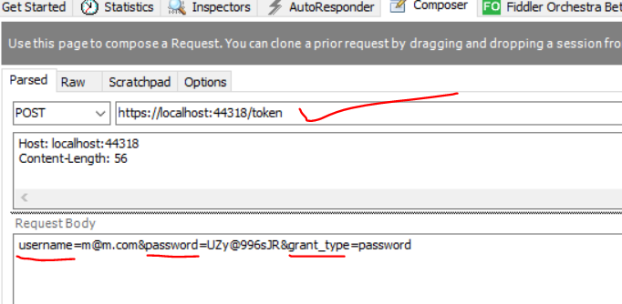
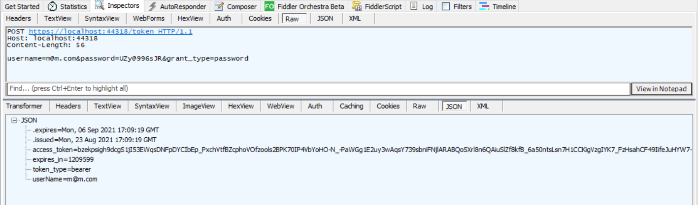
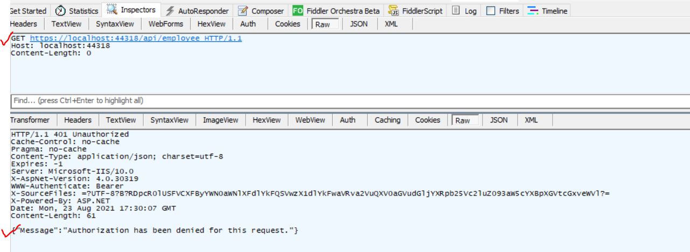
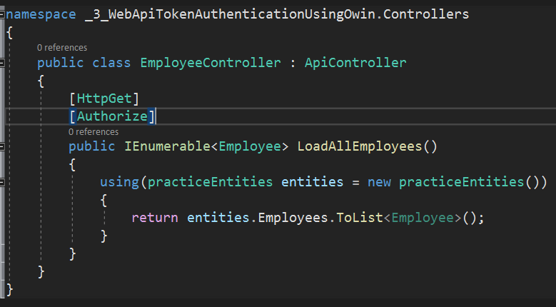
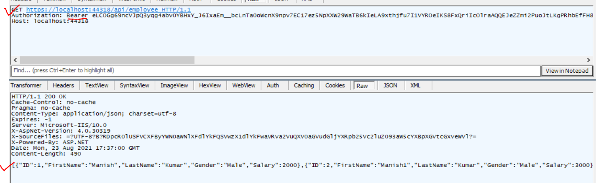

# Implement token based Authentication in .NET Web API using OWIN Middleware and Identity Framework

Project: 3_WebApiTokenAuthenticationUsingOwin
Ensure to select Authentication using Individual User Accounts while creating the projects



Follow the Project as is. Watch Kudvent's web api video starting video #20 onwards for more.

Check the Register.html page for code details, on how the validation is being done.

**Notes:**

- By Default, the data will be sotred in side the project itself, use `show all files` in solution explorer, and double click on the .mdf file to see more details. See Below:
  - 
- Upon clicking on the Register button the first time, the program took some additional time to return the results, that was because the program had to create the DB and then do the validation and insertion (if needed) of the data.
- you can configure the automatically generated identity database

  - just go to the web.config file
  - select the desired server, and give proper file name or the database name(.mdf) and the make sure to give the initial catalog as the database name you just given or you can use your application database name(in this way the identity tables will be created inside the existing application database)
  - Cases:

    - To create the identity database in the project itself but different DB name (not the automated name):

      - Before

      ```xml
        <add name="DefaultConnection" connectionString="Data Source=(LocalDb)\MSSQLLocalDB;AttachDbFilename=|DataDirectory|\aspnet-3_WebApiTokenAuthenticationUsingOwin-20210822102302.mdf;Initial Catalog=aspnet-3_WebApiTokenAuthenticationUsingOwin-20210822102302;Integrated Security=True" providerName="System.Data.SqlClient" />
      ```

      - After: identity database name is `myusers`

      ```xml
        <add name="DefaultConnection" connectionString="Data Source=(LocalDb)\MSSQLLocalDB;AttachDbFilename=|DataDirectory|\myusers.mdf;Initial Catalog=myusers;Integrated Security=True" providerName="System.Data.SqlClient" />
      ```

    - To create the identity database in same server but different DB:

      - Before

      ```xml
        <add name="DefaultConnection" connectionString="Data Source=(LocalDb)\MSSQLLocalDB;AttachDbFilename=|DataDirectory|\aspnet-3_WebApiTokenAuthenticationUsingOwin-20210822102302.mdf;Initial Catalog=aspnet-3_WebApiTokenAuthenticationUsingOwin-20210822102302;Integrated Security=True" providerName="System.Data.SqlClient" />
      ```

      

      - After: the newly created identity database will be named myusers in your local db

      ```xml
        <add name="DefaultConnection" connectionString="Data Source=(Local);Initial Catalog=myusers;Integrated Security=True" providerName="System.Data.SqlClient" />
      ```

      

    - To create the identity database in same server and same application DB:

      - Before

      ```xml
        <add name="DefaultConnection" connectionString="Data Source=(LocalDb)\MSSQLLocalDB;AttachDbFilename=|DataDirectory|\aspnet-3_WebApiTokenAuthenticationUsingOwin-20210822102302.mdf;Initial Catalog=aspnet-3_WebApiTokenAuthenticationUsingOwin-20210822102302;Integrated Security=True" providerName="System.Data.SqlClient" />
      ```

      

      - After

      ```xml
        <add name="DefaultConnection" connectionString="Data Source=(Local);Initial Catalog=practice;Integrated Security=True" providerName="System.Data.SqlClient" />
      ```

      

## Significance of the tables in identity database

| Identity database table  | Usage                                                                          |
| ------------------------ | ------------------------------------------------------------------------------ |
| dbo.\_\_MigrationHistory | The presense of this table tells us that our project is using entity framework |
| dbo.AspNetRoles          | This table store info about roles in our table                                 |
| dbo.AspNetUserClaims     | Info about claims in our app                                                   |
| dbo.AspNetUserLogins     | Used by 3rd party authentication providers like facebook, github or google     |
| dbo.AspNetUserRoles      | Its a bridge table which tells us which users is associated with which roles   |
| dbo.AspNetUsers          | Our actual users are present here                                              |

## testing token based identity in fiddler

In the identity database or the AspNetUsers table (Which is a .net OWIN supplied table for storing user identities in web application), you will see that email and username fields are same.

To authenticate a given user, we can generate a token from these fields by calling a POST request to `/token` url in web api as shown below:

- Request:
  
- Response:
  

As you can see from the response screen shot, we got back a token from our POST request and it is of `Bearer` type. We can also see the time period upto which the token is going to be valid.

**Notes:**

- This implementation of `/token` is provided automatically by the Asp.Net Web API project itself during starting of the project.
- To view the actuall implementation: Open `App_Start -> Startup.Auth.cs` has `ConfigureAuth` method, whcih provide the `/Token` endpoint
- The below piece of code is responsible for this:

```C#
        public void ConfigureAuth(IAppBuilder app)
        {
            // Configure the db context and user manager to use a single instance per request
            app.CreatePerOwinContext(ApplicationDbContext.Create);
            app.CreatePerOwinContext<ApplicationUserManager>(ApplicationUserManager.Create);

            // Enable the application to use a cookie to store information for the signed in user
            // and to use a cookie to temporarily store information about a user logging in with a third party login provider
            app.UseCookieAuthentication(new CookieAuthenticationOptions());
            app.UseExternalSignInCookie(DefaultAuthenticationTypes.ExternalCookie);

            // Configure the application for OAuth based flow
            PublicClientId = "self";
            OAuthOptions = new OAuthAuthorizationServerOptions
            {
                TokenEndpointPath = new PathString("/Token"),
                Provider = new ApplicationOAuthProvider(PublicClientId),
                AuthorizeEndpointPath = new PathString("/api/Account/ExternalLogin"),
                AccessTokenExpireTimeSpan = TimeSpan.FromDays(14),
                // In production mode set AllowInsecureHttp = false
                AllowInsecureHttp = true
            };

            // Enable the application to use bearer tokens to authenticate users
            app.UseOAuthBearerTokens(OAuthOptions);

            // Uncomment the following lines to enable logging in with third party login providers
            //app.UseMicrosoftAccountAuthentication(
            //    clientId: "",
            //    clientSecret: "");

            //app.UseTwitterAuthentication(
            //    consumerKey: "",
            //    consumerSecret: "");

            //app.UseFacebookAuthentication(
            //    appId: "",
            //    appSecret: "");

            //app.UseGoogleAuthentication(new GoogleOAuth2AuthenticationOptions()
            //{
            //    ClientId = "",
            //    ClientSecret = ""
            //});
        }

```

- The actual user id and password matching is coming from the `Provider = new ApplicationOAuthProvider(PublicClientId)` line, just right click and see definition and check the `GrantResourceOwnerCredentials` method. See below:

```C#
        public ApplicationOAuthProvider(string publicClientId)
        {
            if (publicClientId == null)
            {
                throw new ArgumentNullException("publicClientId");
            }

            _publicClientId = publicClientId;
        }

        public override async Task GrantResourceOwnerCredentials(OAuthGrantResourceOwnerCredentialsContext context)
        {
            var userManager = context.OwinContext.GetUserManager<ApplicationUserManager>();

            ApplicationUser user = await userManager.FindAsync(context.UserName, context.Password);

            if (user == null)
            {
                context.SetError("invalid_grant", "The user name or password is incorrect.");
                return;
            }

            ClaimsIdentity oAuthIdentity = await user.GenerateUserIdentityAsync(userManager,
               OAuthDefaults.AuthenticationType);
            ClaimsIdentity cookiesIdentity = await user.GenerateUserIdentityAsync(userManager,
                CookieAuthenticationDefaults.AuthenticationType);

            AuthenticationProperties properties = CreateProperties(user.UserName);
            AuthenticationTicket ticket = new AuthenticationTicket(oAuthIdentity, properties);
            context.Validated(ticket);
            context.Request.Context.Authentication.SignIn(cookiesIdentity);
        }
```

Now, Without the access token if we make the request now, then we will get unathorized response as below:



This is because we have decorated the Employee controller with \[Authorize\] attribute:



To fix this we will need to supply the token with the keyword `Bearer` (include a space after bearer keyword) in the Authorization header as shown below. if the token is valid( i.e. not expired) then the authentication will succeed and you will get the output as expected.


