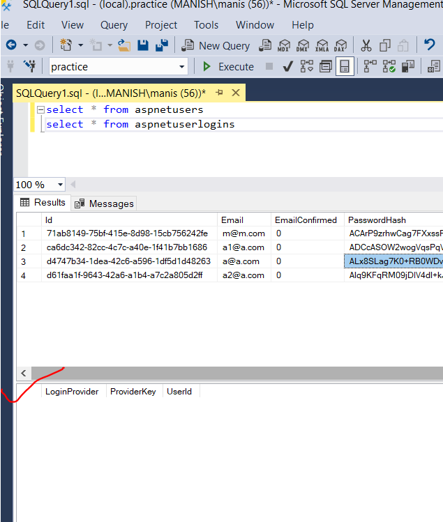
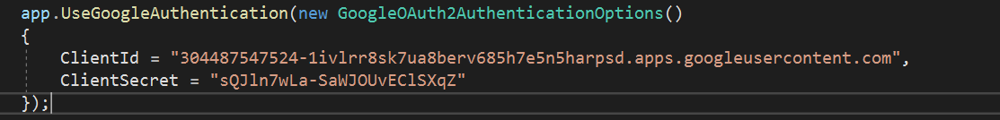

# Web API authentication using Google Authentication

Project Code in Login.HTML in 3_WebApiTokenAuthenticationUsingOwin

Google authentication and facebook authentication allows a way to authenticate users to log into our system or app. To do that we must register our app with google, facebook or any other intended authentication providers.

Benefits of using social login:

- It becomes easy for user to access the application with their existing social media account
- We don't have to provide the security specific implementation for login of the user. It is handled by the login/authentication providers itself.
- Users don't need to remember the password for the app separately.

The authentication or login provider details will get saved in ASPNETUSERS and ASPNETUSERLOGINS tables in the Identity database of the app we created in this projects.

Before the authentication:

## Steps to register our app with google

1. Open https://console.cloud.google.com/ and login using your google account
2. Create a new Project and give a proper name for your project or service and wait for the project to get successfully created
3. Go to Credentials tab and click on `Configure Consent Screen`
   - Give your email ID as the support email and application email
   - Give a valid app name which users will see when logging with google
   - Give your application logo if needed
4. Save and continue
5. Now Using Credential tab create new credention, i.e. API key and secret key
6. So in Credentials tab -> Select Create Credentials -> Create OAuth client ID
7. Give application type: Web Application
8. Add Authorized JavaScript Origin URI, in our case `https://localhost:44318` (Without any path or / character)
9. Add Authorized redirect URI, in our case `https://localhost:44318/signin-google` (Without any path or / character)
10. Note Down the client ID and Secret key as below:
    - Client ID: 304487547524-1ivlrr8sk7ua8berv685h7e5n5harpsd.apps.googleusercontent.com
    - Client Secret Key: sQJln7wLa-SaWJOUvEClSXqZ
11. Finally Enable the google plus api
    - Go to Dashboard of the project and click on `Enable APIs and Services`
    - Find google plus api and enable it
12. Our work for registering our app with google is done

## Enable Google Authenticatiion in ASP .NET WEB API

Uncomment the below code block in `StartUp.Auth.cs` and supply the client secret and client ID procured while register our service with google

## Basic Idea

The basic Idea is that once we click on `Login with Google` -> we will redirect the user to google sign in page, after the user logs into google successfully, the uri will contain the various parameters and most important of then will be the accessToken, which will then be used for logging into the application.
